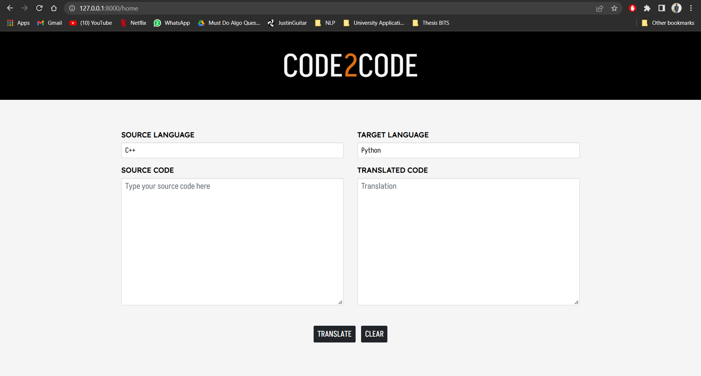

# Code2Code Translator

Code2Code Translator is a web interface built to showcase the workings of Natural Language Processing (NLP) models in translating between Programming Languages (PL). 


## What does this website do?

This website is an interface that enables Users to provide Source Code by selecting their choice of Source and Target Programming Languages, and then translate between the two. 

As of now the website supports translation between two programming languages - `C++` and `Python`. The model used for translation is PLBART.

This is how the homepage looks.

 


## Usage

The website was built using Django framework and the frontend was designed using HTML and CSS. 

In order to deploy it, execute the following steps - 

1. Install Python

2. `pip install -r requirements.txt`

3. Create the following folders in `translate/model`. They have to manually be added to cloned repo locally since git ignores .bin files. This is because PLBART's pretrained checkpoints are more than 500MB so I could not push them to the remote repo from local machine.
    ```
    ├── translate
    |   ├── model
    |   |   ├── plbart
    |   |   |   ├── C++-Python
    |   |   |   |   ├── checkpoint-best-bleu
    |   |   |   |   |   ├── pytorch_model.bin       # Pretrained checkpoints to translate between C++ and Python
    |   |   |   |── Python-C++
    |   |   |   |   ├── checkpoint-best-bleu
    |   |   |   |   |   ├── pytorch_model.bin       # Pretrained checkpoints to translate between Python and C++
    ```
4. Migrate the database \
    `python manage.py migrate` \
    `python manage.py makemigrations`

5. Start server and visit http://127.0.0.1:8000/ \
`python manage.py runserver` \
(Note: The port can be changed if `8000` is in use by mentioning a different port like so - `python manage.py runserver 8080`)


## Starting off

This project requires understanding of Django and how the files interact with each other. I really recommend trying out this tutorial if you're completely new to Django - https://tutorial.djangogirls.org/en/. 

This is the file tree with important files and their roles.

```
├── code2code                   # Main project app        
|   ├── settings.py             # Contains setting for the entire project
|   ├── urls.py                 # Contains all project URLs
├── translate                   # App for translation
|   ├── model                   # Contains all NLP model related files
|   |   ├── output_processing   # Folder that makes output pretty
|   |   ├── plbart              # Folder that contains pretrained model checkpoints
|   |   ├── inference_utils.py  # Utility functions for prediction. Uses model.py and run.py
|   |   ├── model.py            # PLBART model class and methods
|   |   ├── predict.py          # Initializes model and translates code. Uses inference_utils.py
|   |   ├── process_outputs.py  # Formats translated output. Uses files from output_processing
|   |   ├── run.py              # Has classes used by inference_utils.py
|   ├── static                  
|   |   ├── ace                 # Folder contains Ace editor related files 
|   |   ├── css                 
|   |   |   ├── translate.css   # CSS for home.html        
|   ├── templates               # Folder contains HTML files
|   |   ├── base.html           # HTML skeleton
|   |   ├── home.html           # Homepage of website. Takes User input through form and displays translated output. Contains AJAX call javascript    
|   ├── forms.py                # Defines the input form  
|   ├── models.py               # Defines database and objects
|   ├── urls.py                 # URLs specific to translate app
|   ├── views.py                # Views render html pages and return responses to web requests 
├── manage.py                   # Executes Django specific tasks
```


## Integrating the Model

The model used for translation is PLBART. The model's pretrained checkpoints for the two programming language pairs `C++-Python` and `Python-C++` are stored in `translate/model/plbart` directory. 

The model, it's configuration and the tokenizer are initialized from Huggingface and the pretrained checkpoints are used to load the model's state dictionary. 

There are three steps while doing the translation.

1. Initializing the model, config and tokenizer from Huggingface.
2. Loading specific model state dictionary based on the Source and Target programming languages the User selected. 
3. Making a prediction on one data point (the Source Code inputted by User).

While Steps 2 and 3 are dependent on User inputs, Step 1 is independent of the User and it's the most time consuming. Repeating Step 1 every time the User presses the Translate button will take too long. 

Which is why Step 1 (model initialization from Huggingface) is executed only ONCE, when server is started. Steps 2 and 3 happen whenever the User clicks the Translate button. 


## Flowchart for Reference

This flowchart provides a detialed view of the workflow when a User provides inputs and clicks the Translate button.

 


## Syntax Highlighting 

Ace editor is used as a field widget in `form.py` for syntax highlighting. It supports almost all programming languages, and it provides many editor themes. 

The only issue with Ace currently is choosing the mode (programming language) beforehand in the backend. Ideally the mode should switch based on the programming language selected from the dropdowns.

This is how the website looks with Ace implemented. The theme on the left is `twilight` and the theme on the right is `chrome`.

 


## Next Steps

- Implementing live syntax highlighting in the input textarea, based on the programming languages selected from the dropdowns. Currently, Ace editor is used for syntax highlighting, but the programming language has to be set in the backend.

- Compiling Source Code provided by User to check for errors before the model proceeds with prediction. 

- Adding input fields to input test cases. 

- Compile and run the testcases provided by integrating backend with online code editors (hackerearth api) or a docker container with images for each programming language. 

- Expand the types of models (CodeBERT, GraphCodeBERT, etc) with support for more programming languages (Java, C, C#, Javascript, PHP). The checkpoints can be stored in the server and the state dictionary can be loaded for the particular programming language pair chosen for translation. 